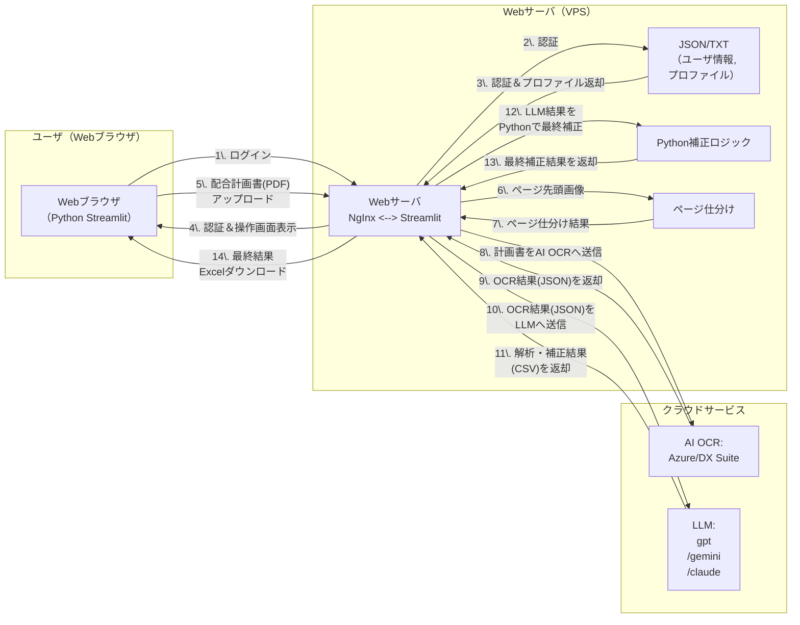

# 全体構成（Web アプリ版）

```mermaid
graph LR

subgraph "ユーザ（Webブラウザ）"
    A[Webブラウザ<br>（Python Streamlit）]
end

subgraph "Webサーバ（VPS）"
    B[Webサーバ<br>NgInx <--> Streamlit]
    C[JSON/TXT<br>（ユーザ情報,<br>プロファイル）]
    G[Python補正ロジック]
    D[ページ仕分け]
end

subgraph "クラウドサービス"
    E[AI OCR:<br>Azure/DX Suite]
    F[LLM:<br>gpt<br>/gemini<br>/claude]
end

A -- 1\. ログイン --> B
B -- 2\. 認証 --> C
C -- 3\. 認証＆プロファイル返却 --> B
B -- 4\. 認証＆操作画面表示 --> A
A -- 5\. 配合計画書(PDF)<br>アップロード --> B
B -- 6\. ページ先頭画像 --> D
D -- 7\. ページ仕分け結果 --> B
B -- 8\. 計画書をAI OCRへ送信 --> E
E -- 9\. OCR結果(JSON)を返却 --> B
B -- 10\. OCR結果(JSON)を<br>LLMへ送信 --> F
F -- 11\. 解析・補正結果<br>(CSV)を返却 --> B
B -- 12\. LLM結果を<br>Pythonで最終補正 --> G
G -- 13\. 最終補正結果を返却 --> B
B -- 14\. 最終結果<br>Excelダウンロード --> A

```
